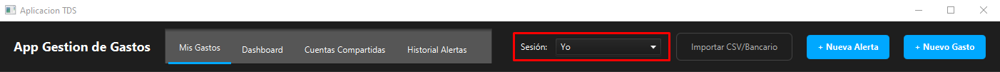
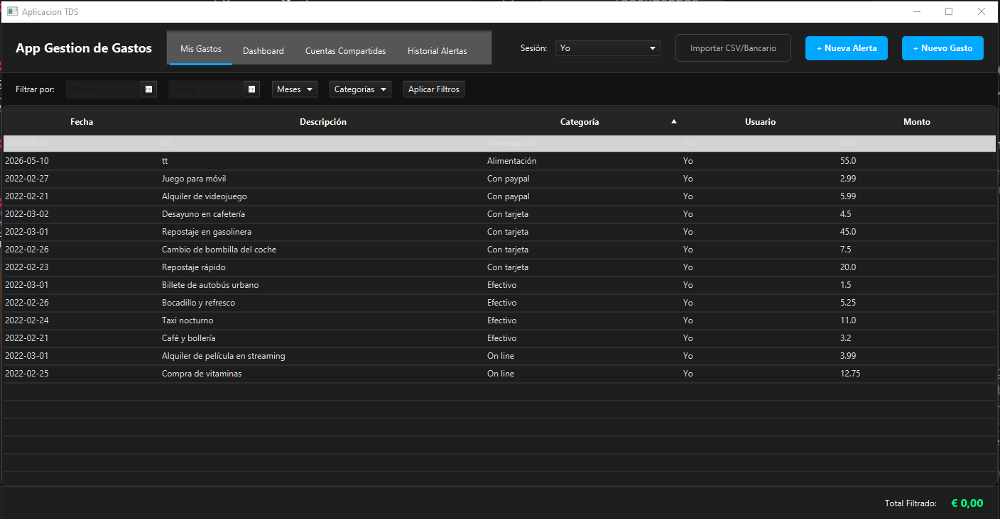
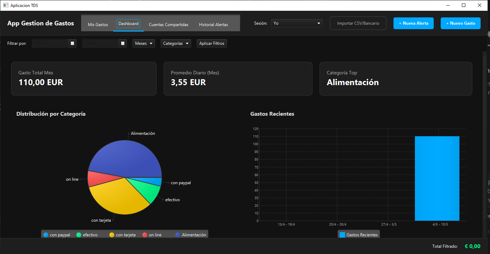
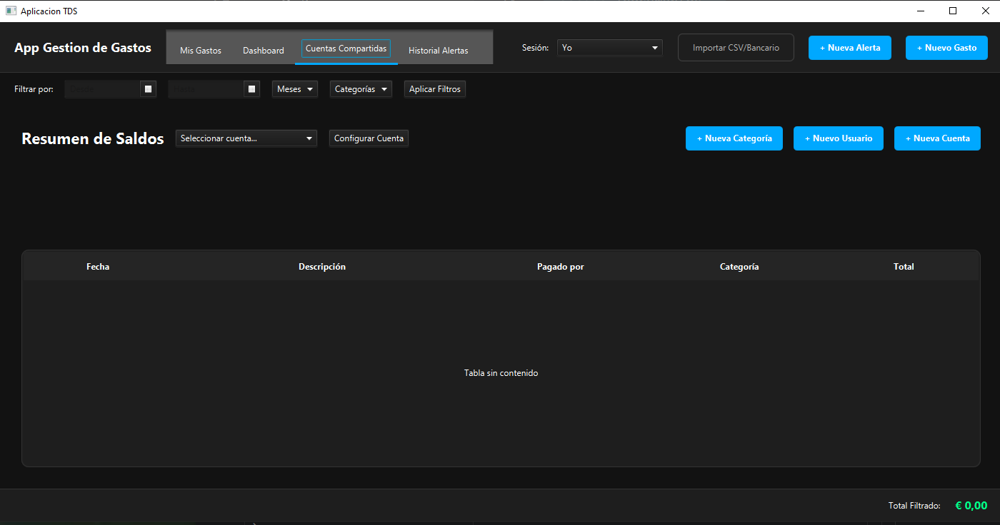
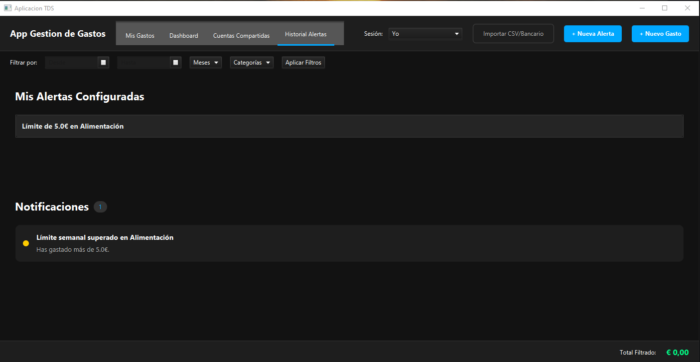
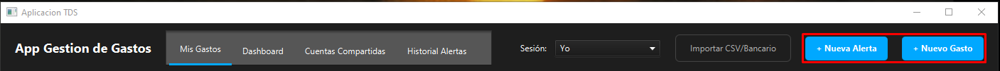
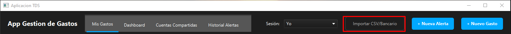

# Manual de Usuario

Esta guía explica cómo usar la aplicación **Gestión de Gastos** en sus dos modos (interfaz gráfica y línea de comandos), y qué formato deben tener los ficheros para importar datos.

## 1. Requisitos
- **Java JDK 21** o superior.
- **JavaFX**, ya incluido como dependencia en el `pom.xml`.

## 2. Cómo arrancar la aplicación

### 2.1. Modo gráfico (GUI)
Es el modo por defecto:

```bash
java -jar gestionGastos.jar
```

También puedes ejecutar la clase `App` o `Launcher` desde el IDE, o hacer doble clic en el `.jar`.

### 2.2. Modo línea de comandos (CLI)
Se activa pasando el argumento `--cli`:

```bash
java -jar gestionGastos.jar --cli
```

Desde el IDE: añade `--cli` como argumento de programa, o lanza directamente la clase `cli.CLI`.

El menú del CLI tiene estas opciones:

| Opción | Acción |
| :---: | --- |
| 1 | Registrar gasto |
| 2 | Modificar gasto |
| 3 | Eliminar gasto |
| 4 | Listar mis gastos |
| 5 | Cambiar de usuario |
| 6 | Crear alerta (mensual o semanal) |
| 7 | Listar alertas |
| 8 | Ver notificaciones |
| 9 | Importar gastos desde fichero (CSV o JSON) |
| 0 | Salir (guarda los datos antes de cerrar) |

## 3. Uso de la interfaz gráfica

### 3.1. Ventana principal y selección de usuario
Al arrancar verás cuatro pestañas (*Mis Gastos*, *Dashboard*, *Cuentas Compartidas* e *Historial Alertas*) y una cabecera con el selector de usuario activo y los botones para acciones rápidas.



El usuario activo es a quien se le asignan los gastos nuevos y de quien se ven las notificaciones. Para crear más usuarios, ve a la pestaña *Cuentas Compartidas* y pulsa **"+ Nuevo Usuario"**.

### 3.2. Mis Gastos
La pestaña *Mis Gastos* muestra una tabla con los gastos del usuario activo (fecha, descripción, categoría e importe). Encima de la tabla está la barra de filtros, que permite filtrar por intervalo de fechas, por meses concretos o por categorías.



Si editas o borras un gasto desde aquí, los cambios se ven al momento en el *Dashboard* y en el cálculo de las alertas.

### 3.3. Dashboard
La pestaña *Dashboard* es un resumen visual:

- Tarjetas con el gasto total del mes, el promedio diario y la categoría con más gasto.
- Gráfico circular con el reparto del gasto por categorías.
- Gráfico de barras con los gastos más recientes.



Los filtros que apliques en *Mis Gastos* también afectan a las gráficas.

### 3.4. Cuentas compartidas
En la pestaña *Cuentas Compartidas* puedes ver los gastos compartidos con otras personas. Una vez que eliges una cuenta del desplegable puedes:

- Ver el saldo de cada participante (en verde si le deben y en rojo si debe).
- Ver la tabla de gastos de la cuenta.
- Crear usuarios, categorías o cuentas nuevas desde los botones de la cabecera.
- Renombrar la cuenta, cambiar los porcentajes o eliminarla con el botón **"Configurar Cuenta"**.



Hay dos tipos de cuenta: equitativa (todos pagan lo mismo) y porcentual (cada uno paga un porcentaje, y la suma tiene que dar 100%).

### 3.5. Alertas y notificaciones
La pestaña *Historial Alertas* tiene dos partes: las alertas que has configurado y el historial de notificaciones que ha generado el sistema cuando se ha pasado algún límite.



Para crear una alerta nueva pulsa **"+ Nueva Alerta"** en la cabecera. Puedes elegir entre semanal o mensual, y opcionalmente puedes asociarla a una categoría concreta (por ejemplo, *100€ al mes en Ocio*).

### 3.6. Diálogos para crear cosas
Las altas de gastos y alertas se hacen en ventanas modales:



Los formularios validan los datos antes de guardar. Si falta algún campo o los porcentajes de una cuenta no suman 100%, te avisa con un mensaje de error.

## 4. Importar gastos desde un fichero

La aplicación puede leer un fichero externo y crear los gastos automáticamente. La extensión del fichero decide qué adaptador se usa.



- En la **GUI**: botón **"Importar CSV/Bancario"** de la cabecera.
- En el **CLI**: opción **[9]**, escribiendo la ruta del fichero.

### 4.1. Formato CSV
Sirve para extractos bancarios con esta cabecera:

```
Date,Account,Category,Subcategory,Note,Payer,Amount,Currency
3/2/2022 10:11,Personal,con tarjeta,Comida,Desayuno,Me,4.50,EUR
```

- La fecha va en formato `M/d/yyyy H:mm`.
- Si en `Payer` pone `"Me"`, el gasto se asigna al usuario activo. Si pone otro nombre, se asigna a ese usuario (y se crea si no existe).

### 4.2. Formato JSON
Se espera un array con los campos básicos del gasto:

```json
[
  {"fecha":"2026-04-01","descripcion":"Desayuno","monto":4.50,"categoria":"Comida","payer":"Me"},
  {"fecha":"2026-04-02","descripcion":"Metro","monto":1.50,"categoria":"Transporte"},
  {"fecha":"2026-04-03","descripcion":"Cine","monto":9.90,"categoria":"Ocio","payer":"Anthony"}
]
```

- `fecha` en formato `yyyy-MM-dd`.
- `payer` es opcional. Si falta o pone `"Me"`, el gasto se asigna al usuario activo.
- Si la categoría no existe, se crea sola.
- Si el usuario que aparece en `payer` no existe, también se crea solo.

## 5. Dónde se guardan los datos

Toda la información (usuarios, categorías, gastos, cuentas compartidas, alertas y notificaciones) se guarda en formato JSON en la subcarpeta `datos/`, que está junto al ejecutable.

- Los datos se cargan al arrancar la aplicación.
- Se guardan al cerrar la ventana en GUI o al salir del CLI con la opción `0`.

Si quieres empezar de cero, borra la carpeta `datos/`:

```powershell
Remove-Item .\datos -Recurse -Force
```
